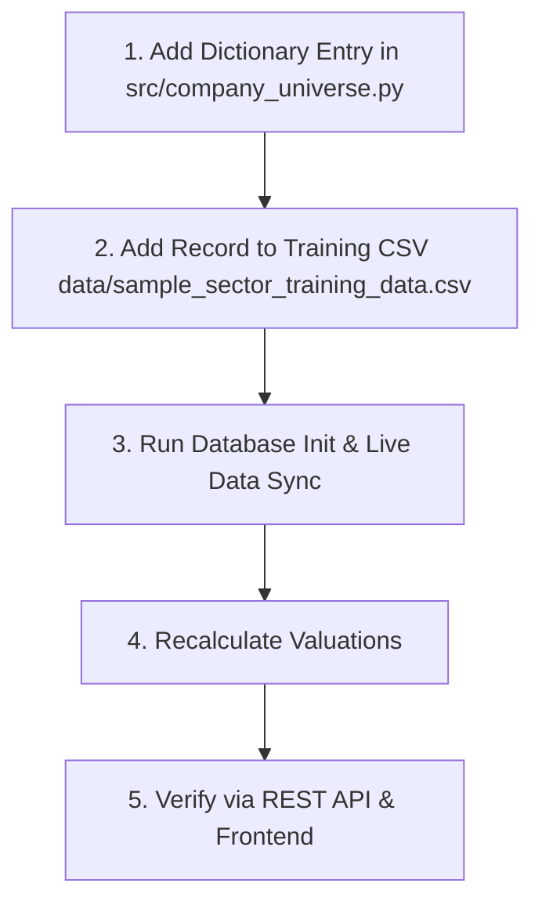

# How to Add New Companies to the Valuation Universe

This guide provides step-by-step instructions on how to expand the target research universe by adding new company ticker symbols (e.g. `RELIANCE.NS`, `TATAMOTORS.NS`, `WIPRO.NS`) to the **Valuation OS**.

---

## 📋 Overview of Steps

To add a new company to the system:



---

## 🛠️ Step 1: Register Company in `src/company_universe.py`

Open `src/company_universe.py` and append a new dictionary entry to the `COMPANIES_20` list (or your expanded list).

### Dictionary Schema Specification

```python
{
    "symbol": "RELIANCE.NS",                # Yahoo Finance ticker symbol (must end in .NS for NSE)
    "ticker": "RELIANCE",                   # Stock symbol without exchange extension
    "legal_name": "Reliance Industries Limited",
    "common_name": "Reliance",
    "isin": "INE002A01018",                 # ISIN Code
    "bse_code": "500325",                   # BSE Scrip Code
    "sector": "Manufacturing / Auto",        # One of the 6 active Sector Packs
    "subsector": "Oil & Gas / Diversified", # Detailed subsector description
    "market_cap_class": "Large Cap",        # Large Cap, Mid Cap, or Small Cap
    "listing_status": "Listed",
    
    # Layer A & Layer B Qualitative Attributes
    "financial_nature": "Non-Financial",    # 'Financial' (for Banks/NBFCs) or 'Non-Financial'
    "lifecycle": "Mature",                  # High Growth, Mature, Cyclical, or Distressed
    "business_model": "Integrated Energy & Retail",
    "asset_intensity": "Capital Intensive", # Capital Intensive, Asset Light, or Financial Balance Sheet
    "structure_type": "Simple",             # Simple or Conglomerate
    "regulatory_model": "Regulated",        # Regulated or Market Driven
    
    # Method Eligibility & Veto Rules
    "primary_methods": ["FCFF DCF", "EV/EBITDA", "P/E"],
    "veto_methods": ["DDM", "P/B"],         # Methods to explicitly exclude
}
```

#### Approved Sector Pack Names
Ensure the `"sector"` field matches one of the 6 standardized Sector Packs so sector weights and frontend filters group it correctly:
1. `Banks & NBFCs`
2. `IT Services`
3. `FMCG / Consumer`
4. `Manufacturing / Auto`
5. `Infrastructure / EPC`
6. `Pharmaceuticals`

---

## 📊 Step 2: Add Row to Neural Training CSV (`data/sample_sector_training_data.csv`)

If you want the new company included when training Neural Network method weights on the `/train` portal, append a row to `data/sample_sector_training_data.csv`:

```csv
company_id,legal_name,sector,subsector,revenue_growth,operating_margin,roe,debt_to_equity,pe_ratio,pb_ratio,actual_fair_value
RELIANCE.NS,Reliance Industries Limited,Manufacturing / Auto,Oil & Gas,0.11,0.16,0.13,0.42,24.5,2.1,3150.0
```

---

## 🔄 Step 3: Initialize Database & Fetch Market Data

Run the sync utility script in your terminal to create database records and fetch live market data from Yahoo Finance:

```bash
python scripts/sync_data.py
```

Alternatively, invoke Python interactive shell or code script:

```python
from src.database import init_db
from src.data_fetcher import fetch_and_store_company_data
from src.valuation_service import run_valuation_for_company, run_neural_valuation_for_company

# 1. Initialize DB schema
init_db()

# 2. Fetch live data from yfinance
fetch_and_store_company_data("RELIANCE.NS", force_refresh=True)

# 3. Compute baseline & neural valuations
run_valuation_for_company("RELIANCE.NS", force_refresh=True)
run_neural_valuation_for_company("RELIANCE.NS", force_refresh=True)
```

---

## 🧪 Step 4: Verify via REST API & Frontend

1. **Check API Endpoint**:
   Visit `http://127.0.0.1:8000/api/company/RELIANCE.NS` in your browser or run:
   ```bash
   curl http://127.0.0.1:8000/api/company/RELIANCE.NS
   ```
2. **Verify Frontend UI**:
   - Open `http://127.0.0.1:8000/` or `http://127.0.0.1:8000/model-valuation`.
   - The total universe count will automatically update, and the new company card will render in the Grid/Table view.
   - Click the company card to inspect its complete AI Valuation payload.

---

## ❓ Frequently Asked Questions & Troubleshooting

### Q1: What if `yfinance` fails to fetch data for the new ticker?
- **Cause**: The ticker symbol does not exist on Yahoo Finance or does not have the `.NS` extension.
- **Solution**: Test ticker availability on Yahoo Finance website (e.g. `RELIANCE.NS` for NSE India). If `yfinance` returns empty data, `data_fetcher.py` will automatically fall back to baseline estimates.

### Q2: Why is the new company showing as `INCONCLUSIVE`?
- **Cause**: The disagreement ratio between Bull percentile ($Q_{90}$) and Bear percentile ($Q_{10}$) exceeds 3.0x ($Q_{90}/Q_{10} > 3.0$).
- **Solution**: Go to `http://127.0.0.1:8000/train` and click **Train Neural Network on Dataset**. The MLP neural weight engine will adjust sector method weights, dampening outlier methods and resolving the spread.
