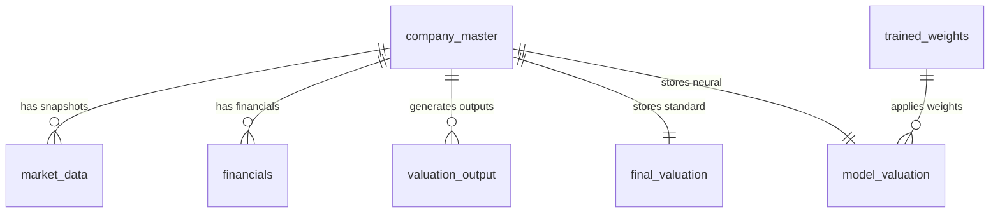

# REST API & Database Reference

This document provides technical documentation for all REST API endpoints served by `app/main.py` and the complete relational database schema for SQLite (`data/valuation.db`).

---

## 🌐 1. REST API Endpoints Reference

### 1. `GET /api/companies`
Returns summary statistics and company list for the 20-company research universe.

- **Query Parameters**:
  - `sector` (optional): Filter by sector name (e.g., `Banks & NBFCs`, `IT Services`).
  - `status` (optional): Filter by valuation classification (e.g., `UNDERVALUED`, `OVERVALUED`).
  - `search` (optional): Search string matching symbol or company name.
- **Sample Response**:
```json
{
  "stats": {
    "total": 20,
    "undervalued": 2,
    "overvalued": 7,
    "fairly_valued": 5,
    "inconclusive": 6,
    "stale_count": 0
  },
  "companies": [
    {
      "company_id": "TCS.NS",
      "common_name": "Tata Consultancy Services",
      "sector": "IT Services",
      "close_price": 2070.7,
      "market_cap": 7500000000000,
      "pe_ratio": 24.5,
      "pb_ratio": 11.2,
      "q10": 1773.0,
      "q50": 3710.1,
      "q90": 4798.1,
      "mispricing": 0.7917,
      "classification": "UNDERVALUED",
      "confidence_score": 85.0
    }
  ]
}
```

---

### 2. `GET /api/company/{symbol}`
Returns full detailed valuation payload for standard equal-weighted model.

- **Parameters**: `symbol` (e.g., `HDFCBANK.NS`, `TCS.NS`)
- **Sample Response**:
```json
{
  "company": {
    "company_id": "HDFCBANK.NS",
    "common_name": "HDFC Bank",
    "sector": "Banks & NBFCs"
  },
  "market": { "close_price": 719.05, "pe_ratio": 18.2, "pb_ratio": 2.6 },
  "valuation": {
    "q50": 602.4,
    "mispricing": -0.1622,
    "classification": "INCONCLUSIVE",
    "status": "WIDE_SPREAD"
  },
  "ai_explanation": {
    "verdict_statement": "HDFC Bank is classified as INCONCLUSIVE...",
    "factors": [ ... ],
    "method_contributions": [ ... ]
  }
}
```

---

### 3. `POST /api/company/{symbol}/refresh`
Forces a live `yfinance` data fetch, updates SQLite, and recalculates valuation for a single company.

---

### 4. `POST /api/refresh-all`
Forces bulk live market data fetch and valuation recalculation for all 20 companies.

---

### 5. `GET /api/train/sample-csv`
Downloads the pre-formatted 30-company sample CSV dataset template (`data/sample_sector_training_data.csv`).

---

### 6. `POST /api/train/upload`
Uploads a training CSV file, executes MLP neural network training, updates weights in SQLite, and recalculates valuations for all 20 companies.

---

### 7. `GET /api/train/status`
Returns latest training run metrics (loss curve, epoch count, final loss) and current stored neural method weights per sector.

---

## 🗄️ 2. SQLite Database Schema Reference (`data/valuation.db`)

The database consists of 11 relational tables managed by `src/database.py`:



### Table Definitions

1. **`company_master`**: Core company registry (ticker, legal name, sector, subsector, market cap class).
2. **`financials`**: Point-in-time financial statements (revenue, EBIT, PAT, equity, debt, EPS, DPS).
3. **`market_data`**: Historical snapshot store (close_price, market_cap, pe_ratio, pb_ratio, ev_ebitda, fetched_at).
4. **`sector_metrics`**: Sector-specific operational KPIs (NIM, NPA, ROE, constant currency growth).
5. **`valuation_inputs`**: Multi-scenario inputs (WACC, terminal growth, Capex ratio, tax rate).
6. **`valuation_output`**: Standalone outputs per method per scenario ($FCFF, DDM, RI, PE, PB, EBITDA$).
7. **`final_valuation`**: Standard ensemble results ($Q_{10}-Q_{90}$, mispricing, classification).
8. **`model_valuation`**: Neural Network weighted ensemble results for `/model-valuation`.
9. **`trained_weights`**: Stored MLP learned method weights per sector pack ($W_{\text{method}}$).
10. **`training_runs`**: Execution log of model training runs (epochs, final loss, loss curve JSON).
11. **`source_ledger`**: Provenance ledger tracking data extraction sources and confidence.

---

## 🛠️ 3. CLI Utilities & Scripts

### `scripts/sync_data.py`
Command-line utility to trigger data sync and database initialization:

```bash
python scripts/sync_data.py
```

### `run.py`
Development server runner launching Uvicorn with auto-reload:

```bash
python run.py
```
