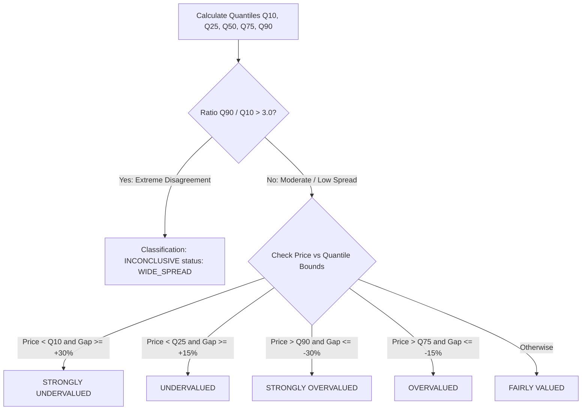

# AI Explanation & Factor Attribution Engine

This document details the inner workings of `src/explanation_engine.py` and `src/ensemble_engine.py`, explaining how plain-English narratives, factor impact extents ($\pm\%$), method contribution shares, quantile distributions, and disagreement circuit breakers are computed.

---

## 🎯 1. Quantile Distribution & Mispricing Classification (`src/ensemble_engine.py`)

### Weighted Quantile Distribution Formulation
The platform combines standalone scenario outputs ($V_{m, sc}$) to compute a non-parametric quantile distribution:

- **$Q_{10}$ (Bear Percentile)**: 10th percentile of scenario valuation outputs.
- **$Q_{25}$ (Lower Quartile)**: 25th percentile.
- **$Q_{50}$ (Median / Target Fair Value)**: 50th percentile (the primary valuation anchor).
- **$Q_{75}$ (Upper Quartile)**: 75th percentile.
- **$Q_{90}$ (Bull Percentile)**: 90th percentile.

### Mispricing Gap Percentage
$$\text{Mispricing Gap \%} = \left( \frac{Q_{50}}{\text{Market Price}} - 1.0 \right) \times 100\%$$

- **Positive Gap ($+\%$)**: Market Price trades below Fair Value $\implies$ **Undervalued / Upside**.
- **Negative Gap ($-\%$)**: Market Price trades above Fair Value $\implies$ **Overvalued / Downside**.

---

## ⚠️ 2. The Disagreement Ratio Circuit Breaker (`INCONCLUSIVE`)

To prevent the system from issuing misleading buy/sell signals when models violently contradict each other, the classifier evaluates the **Disagreement Ratio**:

$$\text{Disagreement Ratio} = \frac{Q_{90}}{\max(Q_{10}, 1.0)}$$

### Why a Company Can Have a Small Gap but Be `INCONCLUSIVE`
A company like **Hindustan Unilever (HINDUNILVR.NS)** may have a small median mispricing gap (**-6.8%**), but if DCF cash flows yield ₹711 while P/E multiples yield ₹2,662, the ratio is $\frac{2662.4}{711.4} = \mathbf{3.74x > 3.0x}$. The circuit breaker fires, marking the record **`INCONCLUSIVE`** to signal high model risk to analysts.

---

## 📊 3. Quantified Factor Impact Attributions (`src/explanation_engine.py`)

The attribution engine quantifies the exact extent of impact ($\pm\%$) contributed by 6 key financial and methodology drivers:

### 1. Neural Sector Weight Priority
$$\text{Impact}_{\text{Method}} = \min(25.0\%, W_{\text{top}} \times 40\%)$$
- Explains why the model prioritizes DCF for industrials or P/B for banks.

### 2. Return on Equity (ROE) Driver
$$\text{Impact}_{\text{ROE}} = (\text{ROE} - 14.0\%) \times 0.8$$
- Positive impact if $\text{ROE} \ge 14.0\%$; negative if $\text{ROE} < 14.0\%$.

### 3. Revenue Growth Rate Driver
$$\text{Impact}_{\text{Growth}} = (g_{\text{rev}} - 8.0\%) \times 0.7$$
- Measures top-line expansion contribution in explicit DCF forecasting.

### 4. Operating Profit Margin Driver
$$\text{Impact}_{\text{Margin}} = (\text{Margin}_{\text{op}} - 15.0\%) \times 0.5$$
- Measures operational conversion efficiency into NOPAT.

### 5. Capital Structure & Leverage Driver
- For Corporates: $\text{Impact}_{\text{D/E}} = -(D/E - 0.5) \times 6.0$ if $D/E > 0.5$.
- For Banks: Evaluated against RBI CET1 capital adequacy benchmarks.

### 6. Market Price vs. Fair Value Gap
$$\text{Impact}_{\text{Gap}} = \text{Mispricing Gap \%} \times 0.4$$
- Quantifies valuation gap magnitude.

---

## ⚖️ 4. Method Valuation Contribution Breakdown

The engine calculates the exact rupee share and percentage contribution of each active method to the target fair value ($Q_{50}$):

$$\text{Weighted Share Value}_m = \text{Fair Value}_m \times \text{Applied Weight}_m$$

$$\text{Contribution Share \%}_m = \left( \frac{\text{Weighted Share Value}_m}{\sum_k \text{Weighted Share Value}_k} \right) \times 100\%$$

### Sample Contribution Table Output

| Valuation Method | Standalone Target Price | Applied Neural Weight | Weighted Share Value | Contribution Share % |
| :--- | :--- | :--- | :--- | :--- |
| **FCFF DCF** | ₹190.50 | 59.93% | ₹114.17 | **51.8%** |
| **EV/EBITDA** | ₹627.50 | 31.73% | ₹199.11 | **35.2%** |
| **P/E Multiple** | ₹660.40 | 8.34% | ₹55.08 | **13.0%** |
| **Total Target ($Q_{50}$)** | — | **100.00%** | **₹368.36** | **100.0%** |
