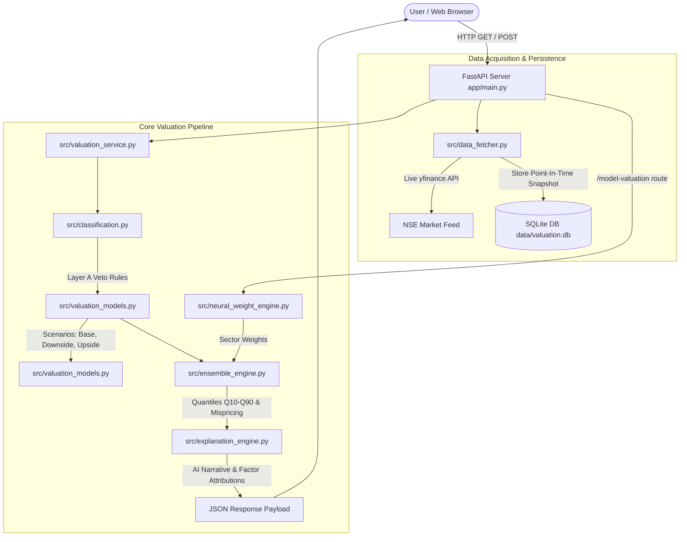
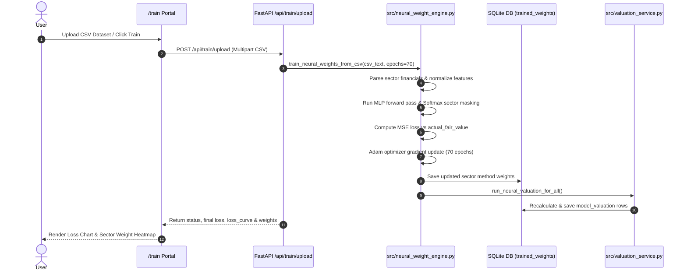

# System Architecture & Technical Flow

This document details the architectural design, data acquisition pipeline, valuation calculation lifecycle, neural network weight training process, and database synchronization flow for the **Practical 20-Company Valuation OS**.

---

## 🏗️ High-Level System Architecture

The application follows a modular, decoupled architecture consisting of:
1. **Presentation Layer (Frontend)**: Single-Page Web Applications (`index.html`, `model_valuation.html`, `train.html`) built with Tailwind CSS, Chart.js, and ES6 Vanilla JavaScript.
2. **API & Orchestration Layer (FastAPI)**: REST API controllers serving template views, JSON endpoints, file upload handling, and orchestrating backend services (`app/main.py`).
3. **Core Valuation & AI Engines (`src/`)**:
   - `valuation_service.py`: Pipeline coordinator for individual and bulk company evaluations.
   - `data_fetcher.py`: Live market data acquisition via `yfinance` with fallback snapshot data.
   - `classification.py`: Two-layer eligibility classifier (Layer A financial nature vetoes & Layer B qualitative attributes).
   - `valuation_models.py`: Multi-scenario valuation engine (FCFF DCF, DDM, Residual Income, P/E, P/B, EV/EBITDA, EV/EBIT, Sensitivity Matrix).
   - `neural_weight_engine.py`: Multi-Layer Perceptron (MLP) Neural Network optimizer for sector method weights.
   - `ensemble_engine.py`: Weighted quantile distribution engine ($Q_{10}, Q_{25}, Q_{50}, Q_{75}, Q_{90}$) and mispricing classifier.
   - `explanation_engine.py`: Plain-English narrative and quantified factor attribution engine.
4. **Persistence Layer (SQLite3)**: Relational point-in-time SQLite database (`data/valuation.db`).

---

## 🔄 End-to-End Execution Flow



---

## 📥 Data Ingestion & Point-In-Time Database Store

### Data Acquisition (`src/data_fetcher.py`)
1. **Target Universe**: 20 pre-configured NSE ticker symbols defined in `src/company_universe.py`.
2. **Freshness Check**: When a valuation request occurs, `data_fetcher.py` checks if market data stored in SQLite is stale ($> 24$ hours old).
3. **Live Sync**: If stale or `force_refresh=True`, `yfinance` fetches live close price, market cap, P/E ratio, P/B ratio, 52-week highs/lows, and financial statements.
4. **Point-In-Time Storage**: Each snapshot is saved with a timestamp `fetched_at`.

### SQLite Deduplication Join Mechanism
To prevent duplicate records from inflating company counts (e.g. producing 40 companies instead of 20), queries in `src/database.py` join a subquery filtering strictly for `MAX(fetched_at)` per `company_id`:

```sql
SELECT cm.company_id, cm.common_name, cm.sector, md.close_price, fv.q50, fv.classification
FROM company_master cm
LEFT JOIN (
    SELECT md1.*
    FROM market_data md1
    INNER JOIN (
        SELECT company_id, MAX(fetched_at) as max_fetched
        FROM market_data
        GROUP BY company_id
    ) md2 ON md1.company_id = md2.company_id AND md1.fetched_at = md2.max_fetched
) md ON cm.company_id = md.company_id
LEFT JOIN final_valuation fv ON cm.company_id = fv.company_id;
```

---

## 🧠 Neural Network Weight Training Lifecycle (`/train`)



### Neural Weight Optimization Formulations
- **Input Features ($X$)**: Sector classification, Revenue Growth, Operating Margin, ROE, Debt/Equity, P/E ratio, P/B ratio.
- **Output Layer ($W$)**: Softmax layer producing non-negative weights per sector summing to 1.0:
  $$\sum_{m \in \text{Methods}} W_{s, m} = 1.0 \quad \forall \text{ Sector } s$$
- **Loss Function**: Mean Squared Error (MSE) between ensemble prediction $\hat{V}_i$ and benchmark fair value $V_i^*$:
  $$\mathcal{L}(\Theta) = \frac{1}{N} \sum_{i=1}^N \left( \sum_{m} W_{s(i), m} \cdot V_{i, m} - V_i^* \right)^2$$
