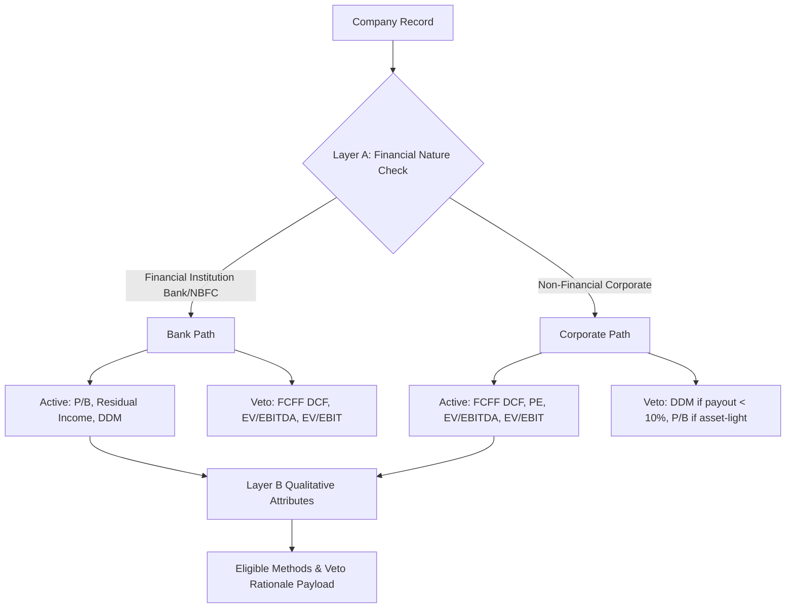

# Valuation Methods, Models & Classification Logic

This document provides the mathematical specifications, sector veto rules, scenario generation parameters, and sensitivity matrix calculations implemented in `src/valuation_models.py` and `src/classification.py`.

---

## 🧮 1. The 7 Valuation Methods & Mathematical Models

### 1. FCFF DCF (Free Cash Flow to Firm)
Discounted Cash Flow model projecting Unlevered Free Cash Flows ($FCFF$) over a 5-year explicit horizon plus Terminal Value ($TV$):

$$FCFF_t = NOPAT_t + \text{D\&A}_t - \Delta NWC_t - Capital Expenditures_t$$

$$\text{Enterprise Value } (EV) = \sum_{t=1}^5 \frac{FCFF_t}{(1 + WACC)^t} + \frac{TV_5}{(1 + WACC)^5}$$

$$TV_5 = \frac{FCFF_5 \cdot (1 + g)}{WACC - g}$$

$$\text{Equity Value} = EV + \text{Cash \& Equivalents} - \text{Total Debt}$$

$$\text{Value Per Share} = \frac{\text{Equity Value}}{\text{Shares Outstanding}}$$

- **Primary Sector Application**: Non-financial sectors (IT Services, FMCG, Auto/Manufacturing, Infrastructure, Pharmaceuticals).
- **Veto Rule**: **VETOED** for *Banks & NBFCs* because debt is operational inventory, not financial leverage.

---

### 2. Dividend Discount Model (DDM)
Values equity based on present value of projected dividend distributions:

$$\text{Equity Value Per Share} = \sum_{t=1}^5 \frac{DPS_t}{(1 + K_e)^t} + \frac{DPS_5 \cdot (1 + g)}{(K_e - g) \cdot (1 + K_e)^5}$$

Where $K_e$ is the Cost of Equity derived via CAPM:
$$K_e = R_f + \beta \cdot (R_m - R_f)$$

- **Primary Sector Application**: High payout financial institutions, regulated utilities, and mature dividend-paying corporates.

---

### 3. Residual Income Model (RI)
Evaluates economic value added over and above the firm's required cost of equity capital on book equity:

$$\text{Residual Income}_t = PAT_t - (K_e \cdot \text{Book Equity}_{t-1})$$

$$\text{Intrinsic Value} = \text{Book Equity}_0 + \sum_{t=1}^5 \frac{\text{Residual Income}_t}{(1 + K_e)^t} + \frac{\text{Residual Income}_5 \cdot (1 + g)}{(K_e - g) \cdot (1 + K_e)^5}$$

- **Primary Sector Application**: *Banks & NBFCs* where book value is the primary valuation anchor.

---

### 4. Price-to-Earnings (P/E) Relative Valuation
Relative multiple valuation anchoring market price to normalized earnings capacity:

$$\text{Target Price}_{\text{PE}} = \text{EPS} \cdot \text{Justified P/E Multiple}$$

$$\text{Justified P/E} = \frac{\text{Payout Ratio} \cdot (1 + g)}{K_e - g}$$

- **Primary Sector Application**: All sectors with positive earnings (IT Services, FMCG, Auto, Pharma).

---

### 5. Price-to-Book (P/B) Relative Valuation
Relative multiple valuation anchoring market price to net asset book value:

$$\text{Target Price}_{\text{PB}} = \text{Book Value Per Share (BVPS)} \cdot \text{Justified P/B Multiple}$$

$$\text{Justified P/B} = \frac{ROE - g}{K_e - g}$$

- **Primary Sector Application**: *Banks & NBFCs* (Primary Anchor).

---

### 6. EV/EBITDA Relative Multiple
Operating Enterprise Value multiple independent of leverage and depreciation policies:

$$EV_{\text{Implied}} = EBITDA \cdot \text{Target EV/EBITDA Multiple}$$

$$\text{Equity Value} = EV_{\text{Implied}} + \text{Cash} - \text{Debt}$$

- **Primary Sector Application**: Capital-heavy manufacturing, auto, infrastructure, and FMCG.

---

### 7. EV/EBIT Relative Multiple
Operating Enterprise Value multiple accounting for capital depreciation:

$$EV_{\text{Implied}} = EBIT \cdot \text{Target EV/EBIT Multiple}$$

$$\text{Equity Value} = EV_{\text{Implied}} + \text{Cash} - \text{Debt}$$

- **Primary Sector Application**: Asset-light services, IT Services, and healthcare.

---

## 🛡️ 2. Two-Layer Classification & Veto Logic (`src/classification.py`)

To ensure methodological rigor, the platform enforces a two-layer classification pipeline:

### Layer A Veto Rules
1. **Financial Institutions Veto**:
   - For `financial_nature == "FINANCIAL"` (Banks & NBFCs), **FCFF DCF**, **EV/EBITDA**, and **EV/EBIT** are strictly **VETOED**.
   - *Rationale*: Banks do not have standard operating cash flows; interest paid is an operating expense, and debt is operational inventory.
2. **Asset-Light P/B Veto**:
   - For asset-light businesses (e.g. IT Consulting), **P/B** is **VETOED** because intellectual capital is not captured on the balance sheet.
3. **Low-Payout DDM Veto**:
   - For companies with dividend payout ratio $< 10\%$, **DDM** is **VETOED**.

### Layer B Qualitative Attributes
- **Financial Nature**: `FINANCIAL` vs. `NON_FINANCIAL`
- **Lifecycle Stage**: `HIGH_GROWTH`, `MATURE_COMPOUNDER`, `CYCLICAL`, `DISTRESSED`
- **Business Model**: `ASSET_LIGHT`, `CAPITAL_INTENSIVE`, `RECURRING_SAAS`, `REGULATED_UTILITY`

---

## 📊 3. Scenario Projections & Sensitivity Matrix (`src/valuation_models.py`)

### Multi-Scenario Parameters

The engine projects three operational scenarios:

| Scenario | Growth Rate ($g_{\text{rev}}$) | Operating Margin | WACC Adjustment | Terminal Growth ($g_{\text{term}}$) | Weight |
| :--- | :--- | :--- | :--- | :--- | :--- |
| **Base Case** | Baseline ($\mu$) | Baseline ($\mu$) | Baseline WACC | Baseline ($2.5\% - 3.5\%$) | **50%** |
| **Downside Case** | Baseline $- 3.0\%$ | Margin $- 2.5\%$ | $+1.0\%$ WACC | Baseline $- 0.5\%$ | **25%** |
| **Upside Case** | Baseline $+ 3.0\%$ | Margin $+ 2.5\%$ | $-1.0\%$ WACC | Baseline $+ 0.5\%$ | **25%** |

---

### WACC vs. Terminal Growth Sensitivity Scenario Matrix

The platform computes a $5 \times 5$ sensitivity matrix varying WACC across rows and Terminal Growth ($g$) across columns:

- **Row Headers (WACC)**: $[ \text{Base}-1.0\%, \text{Base}-0.5\%, \text{Base}, \text{Base}+0.5\%, \text{Base}+1.0\% ]$
- **Column Headers ($g$)**: $[ \text{Base}-1.0\%, \text{Base}-0.5\%, \text{Base}, \text{Base}+0.5\%, \text{Base}+1.0\% ]$

#### Highlighted Cell Coordinates
- 🔵 **`NORMAL (BASE) CASE`**: Row 3, Column 3 $(\text{Base WACC}, \text{Base } g)$
- 🔴 **`DOWNSIDE CASE`**: Row 5, Column 1 $(\text{Base WACC}+1.0\%, \text{Base } g-1.0\%)$
- 🟢 **`UPSIDE CASE`**: Row 1, Column 5 $(\text{Base WACC}-1.0\%, \text{Base } g+1.0\%)$
