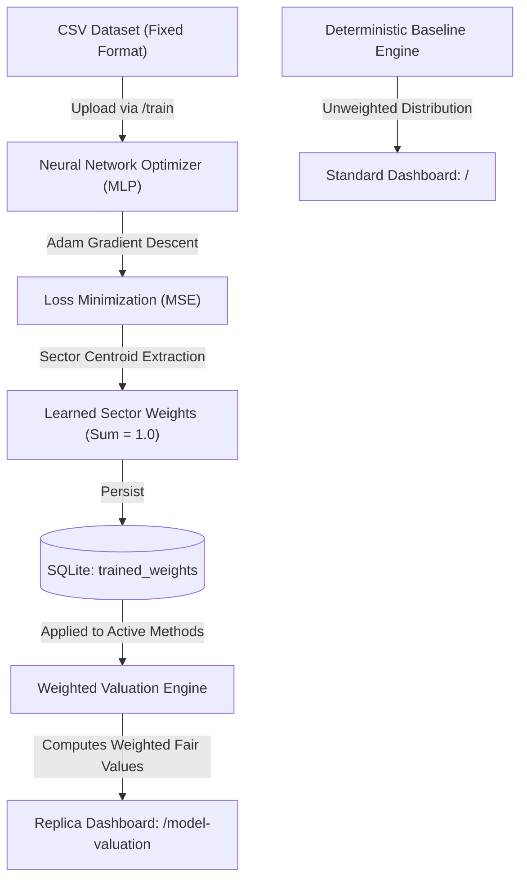

# AI Neural Network Valuation Weight Engine — System Documentation

This document explains the architecture, mathematical formulations, training mechanics, database schemas, and end-user workflows for the Neural Network valuation method weight optimizer and the dual-dashboard valuation portal.

---

## 1. System Overview

Traditional equity valuation models (such as FCFF DCF, P/E multiples, P/B multiples, EV/EBITDA, EV/EBIT, Residual Income, and DDM) have varying reliability depending on industry sectors, balance sheet structures, and economic cycles. 

Instead of relying on static equal weights, this system introduces a **Multi-Layer Perceptron (MLP) Neural Network** that trains on financial metrics across sectors to learn and assign optimal, defensible method weights (\(\sum w_i = 1.0\)) per sector.

### The Portal Architecture: Three Distinct URL Paths
The application provides three separate pages:

| URL Path | Name | Description |
| :--- | :--- | :--- |
| **`/`** | **Standard Valuation** | The baseline valuation dashboard. Calculates company fair values using deterministic scenarios and standard ensemble distributions. |
| **`/model-valuation`** *(or `/replica`)* | **AI Model Valuation** | A full replica dashboard that computes fair values, median Q50, quantiles, and mispricing using the **Neural Network trained weights**. Displays method contribution tables and active weight percentages. |
| **`/train`** | **Model Training Portal** | The training hub where users download pre-formatted sample CSV datasets, upload custom sector training data, trigger neural network training, inspect real-time MSE loss reduction curves, and review the learned sector weight matrix. |



---

## 2. Neural Network Architecture & Weight Engine

The Neural Network is implemented in [`src/neural_weight_engine.py`](file:///c:/Users/satya/Desktop/last/valuation/src/neural_weight_engine.py). It uses a fully vectorized, lightweight, dependency-resilient implementation with Adam gradient optimization.

### 2.1 Network Topology
- **Input Dimension (12 features)**:
  - **Sector One-Hot Vector (6 dims)**: Indicates which sector the company belongs to (`Banks & NBFCs`, `IT Services`, `FMCG / Consumer`, `Manufacturing / Auto`, `Infrastructure / EPC`, `Pharmaceuticals`).
  - **Normalized Financial Features (6 dims)**:
    1. Revenue Growth rate (\(g\))
    2. Operating Margin (\(EBIT / Revenue\))
    3. Return on Equity (\(ROE\))
    4. Financial Leverage (\(Debt / Equity\))
    5. Price-to-Earnings Ratio (\(P/E\))
    6. Price-to-Book Ratio (\(P/B\))
- **Hidden Layer 1**: Dense (32 units) + He Initialization + ReLU activation.
- **Hidden Layer 2**: Dense (16 units) + He Initialization + ReLU activation.
- **Output Layer**: Dense (7 units corresponding to each valuation method).

### 2.2 Seven Core Valuation Methods
The neural network outputs logits for all valuation models:
1. `FCFF DCF` (Free Cash Flow to Firm DCF)
2. `P/E` (Price to Earnings relative multiple)
3. `P/B` (Price to Book relative multiple)
4. `EV/EBITDA` (Enterprise Value to EBITDA)
5. `EV/EBIT` (Enterprise Value to EBIT)
6. `Residual Income` (Book Value + PV of excess equity earnings)
7. `DDM` (Dividend Discount Model)

### 2.3 Sector-Aware Masking & Softmax Normalization
Certain valuation methods are economically invalid for specific sectors (for example, EV/EBITDA is invalid for banks whose deposits and borrowings are operating items; P/B is invalid for asset-light IT services).

Before computing softmax, the network applies a **Sector Mask**:
$$\text{Masked Logit}_i = \begin{cases} z_i & \text{if method } i \text{ is eligible for the sector} \\ -\infty & \text{if method } i \text{ is vetoed} \end{cases}$$

Then, the Softmax function normalizes eligible logits into true probability weights:
$$w_i = \frac{e^{\text{Masked Logit}_i}}{\sum_{j=1}^{7} e^{\text{Masked Logit}_j}}$$

This provides two mathematical guarantees:
1. **Zero Weight on Vetoed Methods**: Vetoed methods strictly receive \(0.0\%\) weight.
2. **Strict Normalization**: The active weights for any sector strictly sum to \(1.0\) (\(100\%\)):
$$\sum_{i \in \text{eligible}} w_i = 1.0$$

### 2.4 Loss Function & Optimization
Given candidate method valuations \(V_1, V_2, \dots, V_k\) and the target benchmark fair value \(V_{\text{target}}\):
- **Predicted Weighted Fair Value**:
$$\hat{V} = \sum_{i=1}^{k} w_i \cdot V_i$$
- **Loss Function (Mean Squared Relative Percentage Error with L2 Regularization)**:
$$\mathcal{L} = \frac{1}{2N} \sum_{n=1}^{N} \left(\frac{\hat{V}_n - V_{\text{target}, n}}{V_{\text{target}, n}}\right)^2 + \frac{\lambda}{2} \|\mathbf{W}\|_2^2$$
- **Optimizer**: **Adam** (Adaptive Moment Estimation) with first-moment tracking (\(\beta_1 = 0.9\)), second-moment tracking (\(\beta_2 = 0.999\)), and bias correction.

---

## 3. The Model Training Portal (`/train`)

Located at URL path `/train`, this portal allows users to train and update the valuation weights.

### 3.1 Fixed CSV Format Specification
Training data must follow a fixed schema. The system includes a ready-to-use template: [`data/sample_sector_training_data.csv`](file:///c:/Users/satya/Desktop/last/valuation/data/sample_sector_training_data.csv).

| Column Name | Data Type | Description & Example |
| :--- | :--- | :--- |
| `company_id` | String | Ticker symbol (e.g. `HDFCBANK.NS`, `TCS.NS`, `ITC.NS`) |
| `legal_name` | String | Official company name (e.g. `HDFC Bank Limited`) |
| `sector` | String | Must match one of the 6 sectors: `Banks & NBFCs`, `IT Services`, `FMCG / Consumer`, `Manufacturing / Auto`, `Infrastructure / EPC`, `Pharmaceuticals` |
| `subsector` | String | Industry subcategory (e.g. `Private Sector Bank`, `IT Consulting`) |
| `revenue_growth` | Float | Annual revenue growth in decimal (e.g. `0.16` for +16%) |
| `operating_margin` | Float | Operating profit margin in decimal (e.g. `0.24` for 24%) |
| `roe` | Float | Return on Equity in decimal (e.g. `0.18` for 18%) |
| `debt_to_equity` | Float | Debt-to-Equity ratio (e.g. `0.85` or `0.05` for asset-light) |
| `pe_ratio` | Float | Prevailing Price-to-Earnings ratio (e.g. `22.5`) |
| `pb_ratio` | Float | Prevailing Price-to-Book ratio (e.g. `3.2`) |
| `market_price` | Float | Current trading price in INR (e.g. `1720.50`) |
| `actual_fair_value` | Float | Target/benchmark fair value in INR (e.g. `1850.00`) |

### 3.2 Features on the `/train` Page
1. **Download Sample CSV**: One-click download of `sample_sector_training_data.csv` pre-populated with 30 realistic companies across all 6 sectors.
2. **Drag-and-Drop Uploader**: Accepts any `.csv` matching the schema.
3. **Training Execution**: Clicking **"Train Neural Network on Dataset"** initiates 70 epochs of Adam optimization.
4. **Live Loss Reduction Chart**: Rendered using Chart.js, visualizes the convergence of the MSE loss across epochs.
5. **Sector Weights Breakdown Cards**: Visual progress bars showing the exact percentage weights assigned to each valuation method per sector.

---

## 4. AI Model-Weighted Valuation Dashboard (`/model-valuation`)

Located at URL path `/model-valuation` (and alias `/replica`), this dashboard displays the valuations computed with the trained neural weights.

### 4.1 Fair Value Calculation
For any given company:
1. Method scenario results (Base, Downside, Upside) are computed.
2. The active sector weights \(w_m\) learned by the neural network are fetched from SQLite table `trained_weights`.
3. The **AI Fair Value (Q50)** is calculated as the weighted sum:
$$Q50 = \sum_{m \in \text{eligible}} w_m \cdot V_m$$
4. Distribution quantiles (Q10 Bear, Q25, Q50 Median, Q75, Q90 Bull) are scaled around the weighted median according to method dispersion.
5. **Mispricing %** is calculated against the live exchange market price:
$$\text{Mispricing} = \frac{Q50 - \text{Market Price}}{\text{Market Price}}$$

### 4.2 Company Cards & Detail Drawer
- **Company Cards**: Feature an `"AI"` badge, live price, Neural Fair Value (Q50), neural mispricing %, and mini-badges showing the top weights.
- **Detail Drawer Modal**:
  - **Neural Network Method Weights Applied**: Visual breakdown of weights allocated to each method for that company's sector.
  - **Method Valuation Breakdown Table**: Lists each valuation method's computed fair value, its assigned neural weight, and its weighted rupee contribution to the total.
  - **Quantile Distribution**: Bear (Q10), Q25, Median (Q50), Q75, and Bull (Q90).
  - **Sensitivity Matrix**: 5x5 WACC vs. Terminal Growth matrix.
  - **Method Eligibility & Veto Notices**: Explicit justification of active and vetoed methods.

---

## 5. Database Schema Additions

The SQLite database (`data/valuation.db`) contains three dedicated tables for the neural weighting subsystem:

### 1. `trained_weights`
Stores the latest learned method weights per sector.
```sql
CREATE TABLE IF NOT EXISTS trained_weights (
    id INTEGER PRIMARY KEY AUTOINCREMENT,
    sector TEXT,
    method TEXT,
    weight REAL,
    model_version TEXT,
    updated_at TIMESTAMP DEFAULT CURRENT_TIMESTAMP,
    UNIQUE(sector, method, model_version)
);
```

### 2. `training_runs`
Logs metadata and performance history for each training run.
```sql
CREATE TABLE IF NOT EXISTS training_runs (
    id INTEGER PRIMARY KEY AUTOINCREMENT,
    run_id TEXT UNIQUE,
    num_samples INTEGER,
    epochs INTEGER,
    final_loss REAL,
    metrics_json TEXT,  -- Contains loss curve coordinates for Chart.js
    created_at TIMESTAMP DEFAULT CURRENT_TIMESTAMP
);
```

### 3. `model_valuation`
Stores valuations computed using the Neural Network weights. This is isolated from the `final_valuation` table used by the standard `/` dashboard.
```sql
CREATE TABLE IF NOT EXISTS model_valuation (
    company_id TEXT PRIMARY KEY,
    as_of_date TEXT,
    market_price REAL,
    q10 REAL,
    q25 REAL,
    q50 REAL,
    q75 REAL,
    q90 REAL,
    mispricing REAL,
    classification TEXT,
    confidence_score REAL,
    status TEXT,
    rationale TEXT,
    weights_applied TEXT,  -- JSON string of {method: weight}
    updated_at TIMESTAMP DEFAULT CURRENT_TIMESTAMP
);
```

---

## 6. Comparison: Standard (`/`) vs AI Model Valuation (`/model-valuation`)

| Feature | Standard Dashboard (`/`) | AI Model Dashboard (`/model-valuation`) |
| :--- | :--- | :--- |
| **URL Path** | `http://127.0.0.1:8000/` | `http://127.0.0.1:8000/model-valuation` |
| **Weighting Method** | Uniform / Scenario-based percentile distribution | Sector-specific weights from Neural Network |
| **Database Table** | `final_valuation` | `model_valuation` |
| **Detail Breakdown** | Unweighted scenario distribution | Method-by-method weighted contribution table |
| **Weights Transparency** | Static distribution | Displays exact neural weights applied |
| **API Endpoints** | `/api/companies`, `/api/company/{symbol}` | `/api/companies/model-valuation`, `/api/company/{symbol}/model-valuation` |

---

## 7. Complete API Reference

### Training Endpoints
- **`GET /api/train/sample-csv`**: Downloads the 30-company sample CSV dataset.
- **`POST /api/train/upload`**: Uploads a CSV file, trains the Neural Network for 70 epochs, saves weights to SQLite, recalculates neural valuations, and returns loss metrics and weight tables.
- **`GET /api/train/status`**: Returns the latest training run metrics, loss curve data, and currently stored weights.

### AI Model Valuation Endpoints
- **`GET /api/companies/model-valuation`**: Returns summary KPI counts and company list with valuations calculated from Neural Network weights.
- **`GET /api/company/{symbol}/model-valuation`**: Returns detailed valuation payload for a single company using Neural Network weights.
- **`POST /api/company/{symbol}/model-valuation/refresh`**: Refreshes single company market data and recalculates neural valuation.
- **`POST /api/refresh-all/model-valuation`**: Triggers bulk recalculation for all 20 companies using the latest neural weights.

---

## 8. Quick Start Guide

### Step 1: Start the Server
```bash
python run.py
```
The server will start on `http://127.0.0.1:8000`.

### Step 2: Access the Training Portal
1. Open your browser and navigate to:
   ```
   http://127.0.0.1:8000/train
   ```
2. Click **"Download Sample CSV"** to save `sample_sector_training_data.csv`.
3. *(Optional)* Modify or add company rows in Excel / VS Code following the same columns.
4. Drag and drop the CSV into the upload box and click **"Train Neural Network on Dataset"**.
5. Watch the MSE loss curve converge and inspect the learned weights matrix.

### Step 3: View the AI-Weighted Valuations
1. Navigate to:
   ```
   http://127.0.0.1:8000/model-valuation
   ```
2. Explore company cards with the AI Fair Value (Q50).
3. Click **"View AI Valuation Detail"** on any company to inspect the method weights applied, weighted contribution in INR, and sensitivity matrix.

### Step 4: Compare with Standard Valuation
Click **"Standard Valuation"** in the top navigation bar (or visit `http://127.0.0.1:8000/`) to compare the AI-weighted results against the baseline valuation.
